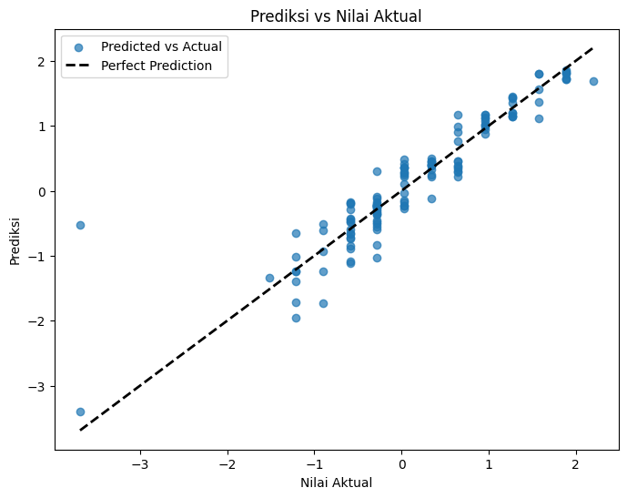

# Laporan Proyek Machine Learning - Kamaruddin

## Domain Proyek

Pendidikan merupakan salah satu pilar utama dalam pembangunan masyarakat. Memastikan siswa mencapai potensi akademik terbaiknya menjadi salah satu fokus utama dalam dunia pendidikan. Namun, pendidik sering kali kesulitan memprediksi performa akademik siswa secara objektif karena berbagai faktor yang memengaruhinya, seperti demografi, kebiasaan belajar, dan lingkungan rumah. 

Masalah ini relevan karena prediksi yang akurat dapat membantu dalam:
1. Memberikan intervensi pembelajaran yang lebih efektif.
2. Membantu orang tua dan siswa untuk memahami kebutuhan pembelajaran mereka.
3. Meningkatkan kinerja lembaga pendidikan secara keseluruhan.

Dataset yang digunakan untuk proyek ini adalah [Student Performance Dataset](https://archive.ics.uci.edu/ml/datasets/Student+Performance) dari UCI Machine Learning Repository, yang menyediakan informasi komprehensif tentang siswa, termasuk nilai mereka, data demografi, dan faktor lain yang memengaruhi performa mereka.

---

## Business Understanding

### Problem Statements
1. Bagaimana memprediksi nilai akhir siswa dengan menggunakan informasi yang tersedia seperti nilai ujian sebelumnya, data demografi, dan lainnya?
2. Apa faktor yang paling mempengaruhi nilai akhir siswa?
3. Bagaimana cara meningkatkan akurasi prediksi nilai menggunakan teknik machine learning?

### Goals
1. Membangun model machine learning yang dapat memprediksi nilai akhir siswa dengan tingkat akurasi yang memadai.
2. Mengidentifikasi faktor-faktor yang paling berpengaruh terhadap nilai akhir siswa.
3. Menggunakan hasil prediksi untuk memberikan rekomendasi pembelajaran yang lebih personal atau intervensi yang lebih efektif bagi siswa.

### Solution Statements
1. Model prediksi nilai akhir siswa akan dibangun menggunakan algoritma Random Forest Regression dan Model Linear Regression.
2. Model akan dioptimalkan melalui tuning hyperparameter untuk meningkatkan akurasi prediksi.
3. Menambahkan fitur tambahan yang relevan, seperti informasi ekstrakurikuler atau catatan prestasi, untuk meningkatkan kualitas prediksi.

---

## Data Understanding

### Informasi Umum
- **Jumlah data**: 649 baris dan 33 kolom.
- **Kondisi data**:
  - Tidak terdapat nilai kosong (missing values).
  - Tidak ditemukan duplikasi data.
  - Terdapat beberapa outlier pada fitur seperti `absences`.
- **Tautan sumber data**: [UCI Machine Learning Repository](https://archive.ics.uci.edu/ml/datasets/Student+Performance).

### Uraian Fitur Dataset
Berikut adalah deskripsi fitur pada dataset:
1. **school**: Sekolah siswa (binary: "GP" atau "MS").
2. **sex**: Jenis kelamin siswa (binary: "F" atau "M").
3. **age**: Usia siswa (numerik: dari 15 hingga 22).
4. **address**: Lokasi tempat tinggal siswa (binary: "U" untuk urban, "R" untuk rural).
5. **famsize**: Ukuran keluarga siswa (binary: "LE3" <= 3 atau "GT3" > 3).
6. **Pstatus**: Status tinggal orang tua siswa (binary: "T" tinggal bersama, "A" terpisah).
7. **Medu**: Tingkat pendidikan ibu (numerik: 0 - tidak bersekolah, 1 hingga 4).
8. **Fedu**: Tingkat pendidikan ayah (numerik: 0 - tidak bersekolah, 1 hingga 4).
9. **Mjob**: Pekerjaan ibu (categorical: "teacher", "health", dll.).
10. **Fjob**: Pekerjaan ayah (categorical: "teacher", "health", dll.).
11. **reason**: Alasan memilih sekolah (categorical: "home", "reputation", dll.).
12. **guardian**: Wali siswa (categorical: "mother", "father", "other").
13. **traveltime**: Waktu tempuh ke sekolah (numerik: 1 hingga 4).
14. **studytime**: Waktu belajar mingguan (numerik: 1 hingga 4).
15. **failures**: Jumlah kegagalan akademik (numerik: 0 hingga 3).
16. **schoolsup**: Dukungan pendidikan sekolah (binary: "yes" atau "no").
17. **famsup**: Dukungan pendidikan keluarga (binary: "yes" atau "no").
18. **paid**: Les tambahan (binary: "yes" atau "no").
19. **activities**: Partisipasi ekstrakurikuler (binary: "yes" atau "no").
20. **nursery**: Pendidikan prasekolah (binary: "yes" atau "no").
21. **higher**: Keinginan untuk melanjutkan pendidikan tinggi (binary: "yes" atau "no").
22. **internet**: Akses internet di rumah (binary: "yes" atau "no").
23. **romantic**: Hubungan romantis (binary: "yes" atau "no").
24. **famrel**: Kualitas hubungan keluarga (numerik: 1 hingga 5).
25. **freetime**: Waktu luang setelah sekolah (numerik: 1 hingga 5).
26. **goout**: Frekuensi keluar bersama teman (numerik: 1 hingga 5).
27. **Dalc**: Konsumsi alkohol di hari kerja (numerik: 1 hingga 5).
28. **Walc**: Konsumsi alkohol di akhir pekan (numerik: 1 hingga 5).
29. **health**: Status kesehatan saat ini (numerik: 1 hingga 5).
30. **absences**: Jumlah ketidakhadiran (numerik: 0 hingga 75).
31. **G1, G2, G3**: Nilai siswa pada triwulan 1, 2, dan 3 (target).

---

## Data Preparation

Tahapan *data preparation* yang dilakukan mencakup:

### 1. **Penanganan Missing Values**:
   - **Pemeriksaan Missing Values**: Mengecek apakah terdapat nilai yang hilang dalam dataset menggunakan `df.isnull().sum()`. 
   - Hasil pemeriksaan menunjukkan bahwa tidak ada missing values pada dataset, sehingga tidak diperlukan imputasi.

### 2. **Penanganan Outlier**:
   - **Identifikasi Outlier**: Outlier diidentifikasi dengan menggunakan **Z-Score** (nilai lebih dari ±3 dianggap sebagai outlier).
   - **Penanganan Outlier**: Kolom yang terdeteksi mengandung outlier, seperti `absences`, dihapus atau dibatasi (misalnya, menggunakan winsorization atau truncation). Hal ini membantu untuk mengurangi pengaruh outlier yang dapat menyebabkan model bekerja tidak optimal.

### 3. **Exploratory Data Analysis (EDA)**:
   - **Visualisasi distribusi target**: Distribusi nilai akhir (`G3`) dipetakan untuk memahami penyebarannya. Histogram digunakan untuk melihat apakah distribusi tersebut normal atau tidak.
   - **Korelasi antar fitur numerik**: Korelasi antara fitur numerik seperti `age`, `G1`, `G2`, `absences` dianalisis menggunakan **heatmap** untuk melihat hubungan antar fitur yang dapat memengaruhi target.

### 4. **Penanganan Tipe Data**:
   - Fitur kategorikal seperti `school`, `sex`, `address`, dan lainnya diubah menjadi numerik menggunakan *One-Hot Encoding* untuk memudahkan pemrosesan lebih lanjut.
   
### 5. **Standarisasi Fitur Numerik**:
   - Fitur numerik seperti `age`, `absences`, `G1`, dan `G2` dinormalisasi menggunakan **StandardScaler** agar distribusi data memiliki nilai rata-rata 0 dan standar deviasi 1.
   - Hal ini memudahkan algoritma pembelajaran mesin, khususnya yang sensitif terhadap skala data.

### 6. **Pembagian Dataset**:
   - Dataset dibagi menjadi **data latih (80%)** dan **data uji (20%)** menggunakan metode acak dengan parameter *random_state* untuk memastikan replikasi hasil.
   - Pembagian dilakukan tanpa stratifikasi, karena target `G3` adalah data numerik.

---

## Modeling

Pada tahap pemodelan, **Random Forest Regressor** digunakan untuk memprediksi nilai akhir siswa (`G3`) berdasarkan fitur-fitur lainnya. Beberapa langkah yang dilakukan adalah:

1. **Random Forest Regression**:
   - Model ini digunakan untuk memprediksi nilai akhir siswa (`G3`) berdasarkan fitur-fitur lainnya.
   - Parameter default: `n_estimators=100`, `random_state=42`.

2. **Hyperparameter Tuning (Untuk Random Forest)**:
   - Untuk meningkatkan performa model Random Forest, dilakukan tuning hyperparameter menggunakan **GridSearchCV** dengan parameter seperti jumlah pohon (`n_estimators`), kedalaman maksimal (`max_depth`), dan jumlah sampel minimum untuk melakukan split (`min_samples_split`).
   - Parameter terbaik yang ditemukan melalui tuning adalah: `{'max_depth': 20, 'min_samples_split': 2, 'n_estimators': 200}`.

---

## Evaluation

Evaluasi model dilakukan untuk menilai seberapa baik model dapat memprediksi nilai akhir siswa. Beberapa metrik evaluasi yang digunakan antara lain:

1. **Evaluasi Model Random Forest:**
   - **Mean Squared Error (MSE):** 0.1491
   - **R² Score:** 0.8407

   Model Random Forest memiliki MSE sebesar 0.1491 dan dapat menjelaskan 84.07% dari variansi data.

2. **Evaluasi Model Random Forest dengan Hyperparameter Tuning:**
   - **Mean Squared Error (MSE):** 0.1470
   - **R² Score:** 0.8429
   - **Best Parameters:** `{'max_depth': 20, 'min_samples_split': 2, 'n_estimators': 200}`

   Setelah tuning hyperparameter, model Random Forest mengalami sedikit peningkatan performa dengan MSE lebih rendah dan R² yang sedikit lebih tinggi.

   
### Dampak Model Terhadap Business Understanding

1. Model berhasil menjawab problem statement dengan akurasi yang memadai.
2. Faktor `G1`, `G2`, dan `absences` terbukti paling berpengaruh terhadap nilai akhir siswa.
3. Solusi ini berdampak pada peningkatan efisiensi dalam merancang program pendidikan berbasis data.

---

## Kesimpulan

Berdasarkan hasil evaluasi, dapat disimpulkan bahwa Model **Random Forest dengan tuning hyperparameter** memberikan hasil yang sedikit lebih baik dibandingkan dengan model **Random Forest tanpa tuning**. Proyek ini menunjukkan bahwa model Random Forest dapat digunakan secara efektif untuk memprediksi nilai akhir siswa berdasarkan fitur yang ada.

---

